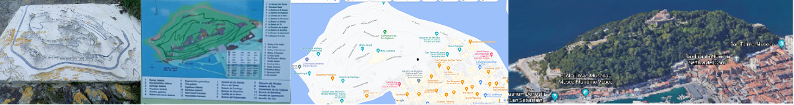

### Alberto Mozo ###

* Distintos soportes y formatos para el plano del monte urgull. De la piedra a google Maps *

## conocimientos ##

## redes sociales ##

## contacto ##
 📫 Puedes contactarme en : albertomozodocente@gmail.com

## mi estado actual ##

- 🔭 Actualmente estoy impartiendo cursos de BACKEND, FRONTEND 
- 🌱 Aprendiendo, desaprendiendo y aprendiendo a aprender
-  Actualmente disfrutando y trabajando duro 💪 con Git y GitHub

<!--
**albertomozo/albertomozo** is a ✨ _special_ ✨ repository because its `README.md` (this file) appears on your GitHub profile.

Here are some ideas to get you started:

- 🔭 I’m currently working on ...
- 🌱 I’m currently learning ...
- 👯 I’m looking to collaborate on ...
- 🤔 I’m looking for help with ...
- 💬 Ask me about ...
- 📫 How to reach me: ...
- 😄 Pronouns: ...
- ⚡ Fun fact: ...
-->
